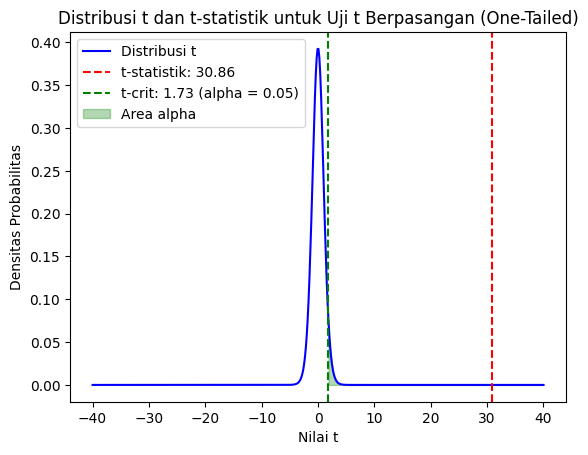
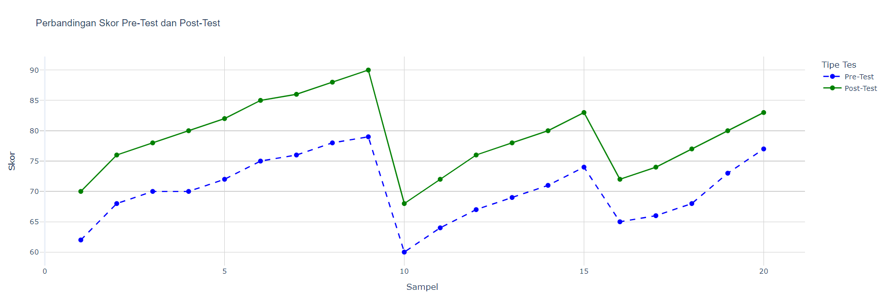
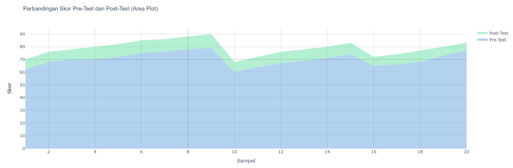
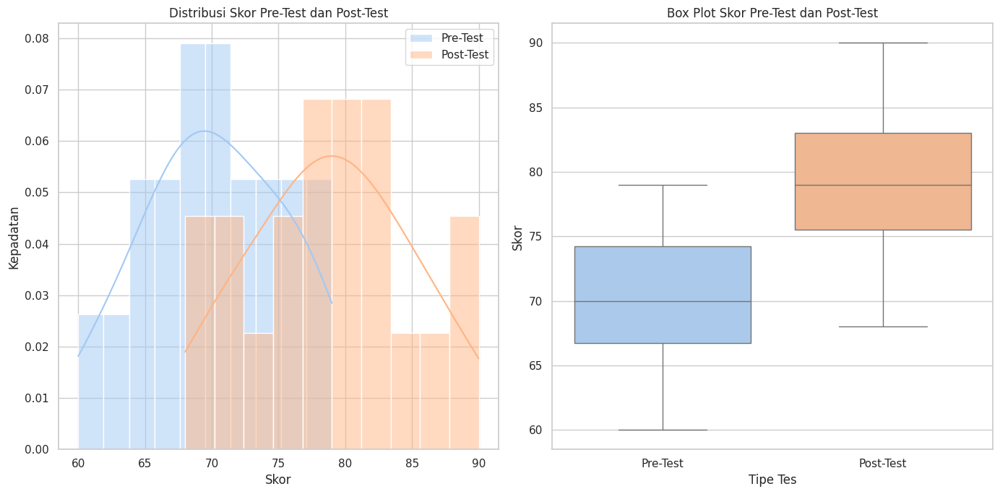
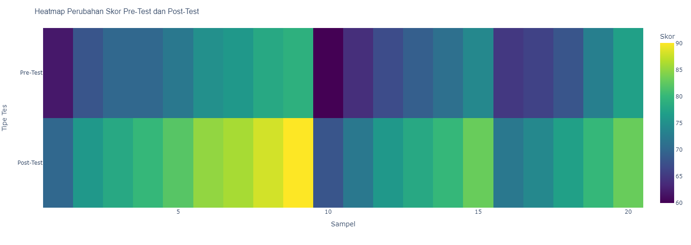

# paired-t-test
**uji statistik menggunkan Python oleh Bu Choiriyah Widyasari & Triaz**
 
terdapat: 
*1. uji normalitas data*  
*2. uji paired t test*
 

>VISUALISASI NORMALITAS DATA:
 
 
 
 
 
 
 
 
 

>VISUALISASI T-TABEL (ONE TAILED) 
> 
 
 
 
 

>VISUALISASI GRAFIK PRE-TEST & POST-TEST

 
 
 

>VISUALISASI TRACE PRE-TEST & POST-TEST

 
 
 
>VISUALISASI DISTRIBUSI SKOR & BOX PLOT PRE-TEST & POST-TEST

 
 
 
>VISUALISASI HEATMAP PRE-TEST & POST-TEST

