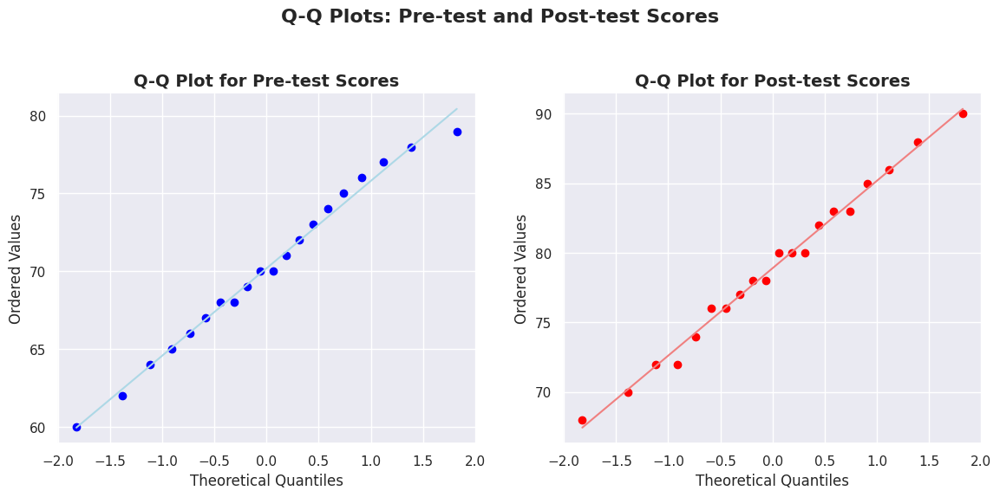
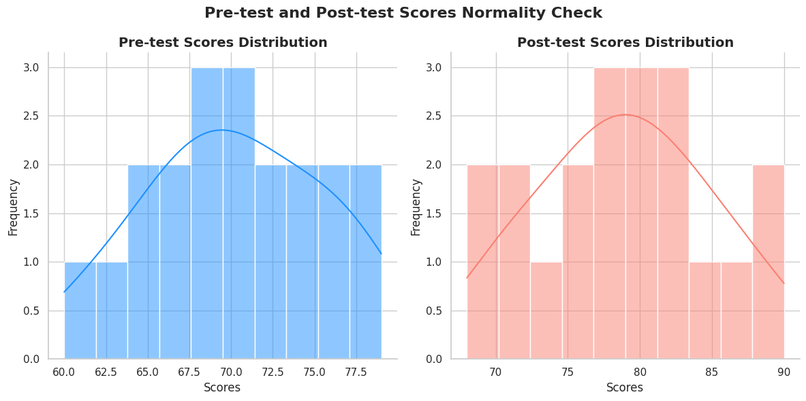

# paired-t-test
**uji statistik menggunkan Python oleh Bu Choiriyah Widyasari & Triaz**
 
terdapat: 
*1. uji normalitas data*  
*2. uji paired t test*
 

VISUALISASI NORMALITAS DATA:

 
 
 

 
 
 
 
